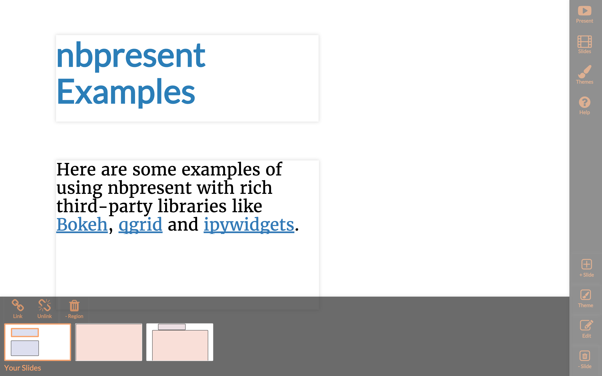

nbpresent
=========

|image0| |image1| |image2|

    remix your `Jupyter Notebooks <http://jupyter.org>`__ as interactive
    slideshows

.. |image0| image:: https://anaconda.org/anaconda-nb-extensions/nbpresent/badges/build.svg
   :target: https://anaconda.org/anaconda-nb-extensions/nbpresent/builds
.. |image1| image:: https://anaconda.org/anaconda-nb-extensions/nbpresent/badges/installer/conda.svg
   :target: https://anaconda.org/anaconda-nb-extensions/nbpresent
.. |image2| image:: https://img.shields.io/pypi/v/nbpresent.svg
   :target: https://pypi.python.org/pypi/nbpresent

Using
-----

After `installing <#install>`__ (and potentially enabling) as
appropriate for your environment, relaunch the Jupyter Notebook: in the
main toolbar, you will get two new buttons that toggle the *Authoring*
and *Presenting* modes.

User Documentation and Community
--------------------------------

When *Authoring*, you can click on the ``(?)`` icon to see a number of
in-Notebook guided tours that show all the features, as well as see
links to community pages:

-  `mailing list <https://groups.google.com/forum/#!forum/nbpresent>`__
   for general or long-term discussion and announcements
-  `issues <https://github.com/Anaconda-Platform/nbpresent/issues>`__
   for technical issues, as well as feature requests
-  `chat <https://gitter.im/Anaconda-Platform/nbpresent>`__ for quickly
   connecting with other users

Related Projects
----------------

-  `live\_reveal/RISE <https://github.com/damianavila/RISE>`__, the
   original inspiration for this work, based on
   `reveal.js <https://github.com/hakimel/reveal.js/>`__.
-  `RMarkdown <http://rmarkdown.rstudio.com/ioslides_presentation_format.html>`__
   presentations

Publishing
----------

When you are happy with your presentation, you can download the
standalone HTML file from the *File -> Download as -> Presentation
(.html)* menu item.

Install
-------

    Note: installing directly off this repo won't work, as we don't ship
    the built JavaScript and CSS assets. See more about
    `developing <#develop>`__ below.

``pip``
~~~~~~~

.. code:: shell

    pip install nbpresent
    python -m nbpresent.install

Then either run

.. code:: python

    %reload_ext nbpresent

*every time you start the notebook* or *enable* the extension for every
notebook launch:

.. code:: shell

    python -m nbpresent.install --enable --user

    ``nbpresent.install`` accepts all of the same arguments as
    ``jupyter nbextension install``.

``conda``
~~~~~~~~~

.. code:: shell

    conda install -c anaconda-nb-extensions nbpresent

This will enable ``nbpresent`` by default.

Export
------

Stock ``nbconvert`` doesn't store quite enough information, so you'll
need to do something like this:

.. code:: shell

    nbpresent -i notebooks/README.ipynb -o README.html

The resulting file can be hosted and viewed (but not edited!) on any
site.

If you have installed
`nbbrowserpdf <https://github.com/Anaconda-Platform/nbbrowserpdf>`__,
you can also export to pdf:

.. code:: shell

    nbpresent -i notebooks/README.ipynb -f pdf -o README.pdf

You can also pass in and get back streams:

.. code:: shell

    cmd_that_generates_ipynb | nbpresent -f pdf > README.pdf

Here's the whole doc:

.. code:: python

    !nbpresent --help

.. parsed-literal::

    usage: nbpresent [-h] [-i IPYNB] [-o OUTFILE] [-f {html,pdf}]
    
    Generate a static nbpresent presentation from a Jupyter Notebook
    
    optional arguments:
      -h, --help            show this help message and exit
      -i IPYNB, --ipynb IPYNB
                            Input file (otherwise read from stdin)
      -o OUTFILE, --outfile OUTFILE
                            Output file (otherwise write to stdout)
      -f {html,pdf}, --out-format {html,pdf}
                            Output format

Develop
-------

This assumes you have cloned this repository locally:

::

    git clone https://github.com/Anaconda-Platform/nbpresent.git
    cd nbpresent

Repo Architecture
~~~~~~~~~~~~~~~~~

The ``nbpresent`` nbextension is built from ``./src`` into
``./nbpresent/static/nbresent`` with: - ``less`` for style - ``es6``
(via ``babel``) for javascript - ``browserify`` for packaging

The ``nbpresent`` python module (server component) is stored in the
``/nbpresent`` folder

Getting Started
~~~~~~~~~~~~~~~

You'll need conda installed, either from
`Anaconda <https://www.continuum.io/downloads>`__ or
`miniconda <http://conda.pydata.org/miniconda.html>`__. You can import a
Python 3.5 development environment named ``nbpresent`` from
``./environment.yml``.

.. code:: shell

    conda update env
    source activate nbpresent

We *still* use ``npm`` for a lot of dependencies, so then run:

.. code:: shell

    npm install
    npm run build

Ensure development asset loading
~~~~~~~~~~~~~~~~~~~~~~~~~~~~~~~~

To ensure that you always get the right assets, install the nbextension
with the ``symlink``, ``force`` and ``enable`` options:

.. code:: shell

    python -m nbpresent.install --overwrite --symlink --enable --user

If developing in a `conda <http://conda.pydata.org/docs/>`__
environment, you would want to pass in ``--prefix`` instead of
``--user``.

Chore Automation
~~~~~~~~~~~~~~~~

+---------+------------+
| Task    | Command    |
+=========+============+
| Build   | ``npm run  |
| all of  | build``    |
| the     |            |
| front   |            |
| end     |            |
| assets  |            |
| with    |            |
| sourcem |            |
| aps     |            |
| for     |            |
| develop |            |
| ment    |            |
+---------+------------+
| Rebuild | ``npm run  |
| on      | watch``    |
| every   |            |
| save    |            |
+---------+------------+
| Rebuild | ``npm run  |
| all of  | dist``     |
| the     |            |
| front   |            |
| end     |            |
| assets, |            |
| and     |            |
| optimiz |            |
| e       |            |
| it      |            |
+---------+------------+
| Run the | ``npm run  |
| CasperJ | test``     |
| S       |            |
| and     |            |
| ``nose` |            |
| `       |            |
| tests   |            |
+---------+------------+
| Check   | ``npm run  |
| code    | lint``     |
| style   |            |
+---------+------------+
| Build   | ``npm run  |
| the     | pkg:conda` |
| conda   | `          |
| package |            |
+---------+------------+
| Build   | ``npm run  |
| **and   | pkg:pypi`` |
| upload* |            |
| *       |            |
| the     |            |
| pypi    |            |
| package |            |
+---------+------------+
| Build   | ``npm run  |
| the     | docs``     |
| ESDoc   |            |
| and     |            |
| Sphinx  |            |
| documen |            |
| tation  |            |
+---------+------------+

Changelog
---------

3.0.0
~~~~~

-  Update to notebook 4.2

2.0.0
~~~~~

-  Theme editor removed. Significant work required to stabilize to
   public release quality.
-  Adding some themes extracted from reveal.js

1.1.1
~~~~~

-  fixing enabling on windows with ``nb_config_manager`` 0.1.3
-  trimming down conda packages
-  more reproducible builds

1.1.0 (Unreleased)
~~~~~~~~~~~~~~~~~~

-  fixing issue with slides without regions and some layouts crashing
   editor
   `#58 <https://github.com/Anaconda-Platform/nbpresent/issues/58>`__
-  adding JS extensibility of themes (partial
   `#44 <https://github.com/Anaconda-Platform/nbpresent/issues/44>`__)
-  see `Extending
   nbpresent <https://github.com/Anaconda-Platform/nbpresent/blob/master/notebooks/Extending%20nbpresent.ipynb>`__

1.0.0
~~~~~

-  `Theme
   editor <https://github.com/Anaconda-Platform/nbpresent/pull/41>`__
-  Much more consistent UI
-  Mnay bug fixes and more testing
